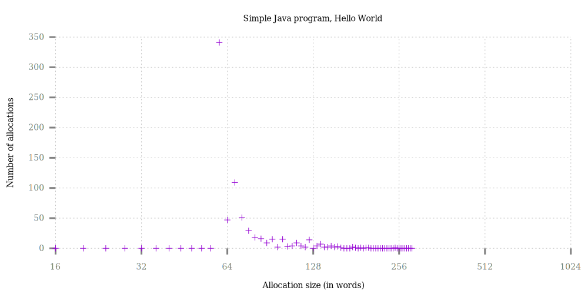
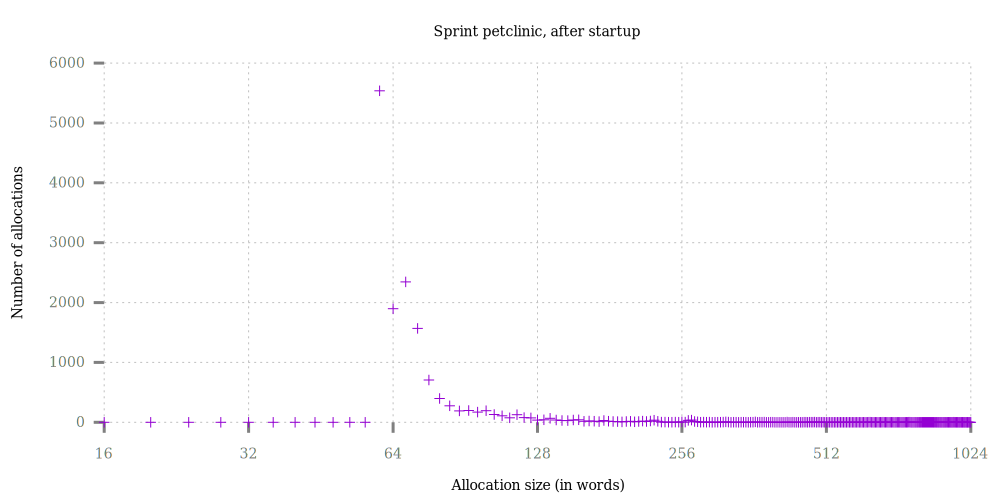
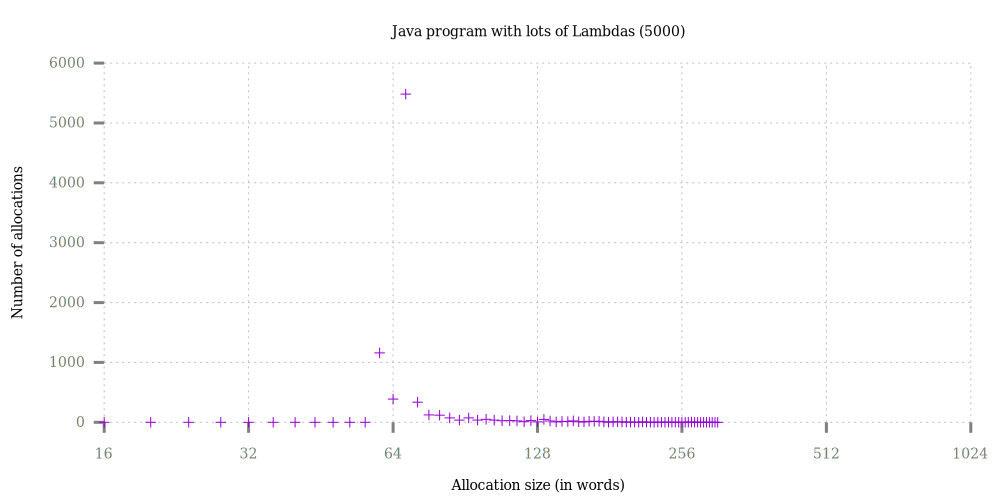
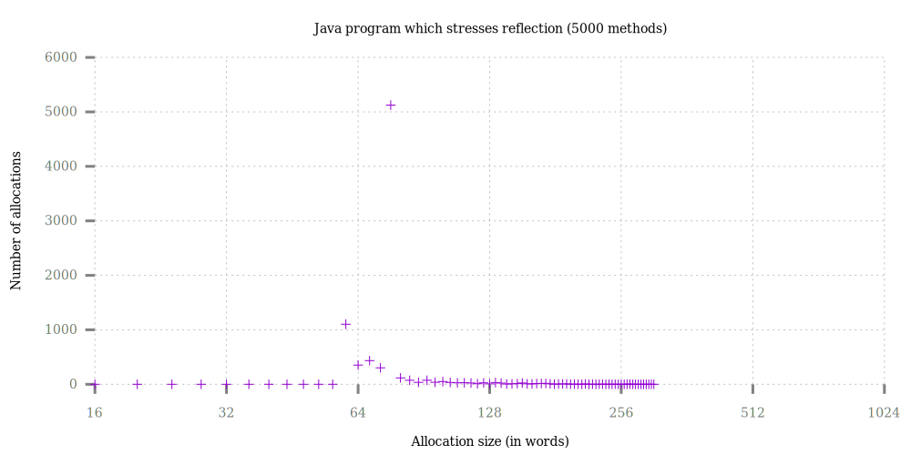

# metaspace-klass-size-analysis
Klass size distribution analysis

All tests done with `-Xshare:off` to remove the distorting effect of CDS on Klass storage.

All tests done on 64-bit, so word size = 8 (64 words = 512 bytes)

